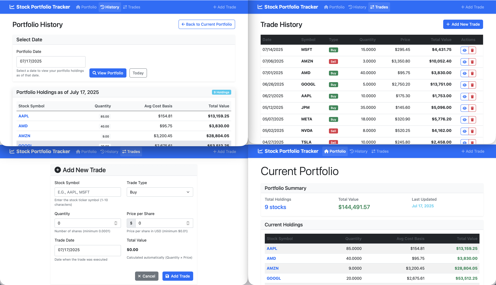

# Stock Portfolio Tracker

A comprehensive .NET 8 web application for managing personal stock portfolios by tracking daily stock holdings and trade transactions. Built with ASP.NET Core MVC, Entity Framework Core, and Bootstrap for a clean, responsive user interface.

## Initial Kiro Prompt
I want to create a .Net application that takes a list of personal stocks and trades for a given day. I want to track the history of what stocks I have per day.



## Features

- **Trade Management**: Record buy/sell transactions with comprehensive validation
- **Portfolio Tracking**: View current holdings with quantities and average cost basis
- **Historical Analysis**: See portfolio composition for any specific date
- **Data Integrity**: Built-in data validation and corruption detection
- **Responsive Design**: Bootstrap-powered UI that works on all devices
- **Persistent Storage**: SQLite database with automatic migrations

## Technology Stack

- **Framework**: .NET 8.0
- **Web Framework**: ASP.NET Core MVC
- **Database**: SQLite with Entity Framework Core 9.0.7
- **Frontend**: Bootstrap CSS (no custom CSS)
- **Testing**: xUnit with comprehensive unit tests

## Getting Started

### Prerequisites

- [.NET 8.0 SDK](https://dotnet.microsoft.com/download/dotnet/8.0)
- Any modern web browser

### Installation

1. **Clone the repository**
   ```bash
   git clone <repository-url>
   cd stock-portfolio-tracker
   ```

2. **Restore dependencies**
   ```bash
   dotnet restore
   ```

3. **Run the application**
   ```bash
   cd StockPortfolioTracker
   dotnet run
   ```

4. **Access the application**
   - Open your browser and navigate to `https://localhost:5001` or `http://localhost:5000`
   - The application will automatically create the database and seed sample data in development mode

## Usage

### Recording Trades

1. Navigate to the "Trades" section
2. Click "Add New Trade"
3. Fill in the trade details:
   - **Stock Symbol**: 1-10 alphanumeric characters (e.g., AAPL, MSFT)
   - **Quantity**: Number of shares (must be positive)
   - **Price**: Price per share (must be positive)
   - **Trade Type**: Buy or Sell
   - **Trade Date**: When the trade was executed

### Viewing Portfolio

- **Current Holdings**: See all stocks you currently own with quantities and average cost basis
- **Trade History**: View chronological list of all your trades
- **Historical Portfolio**: Select any date to see your portfolio composition on that day

## Project Structure

```
StockPortfolioTracker/
├── Controllers/           # MVC Controllers
├── Data/                 # Entity Framework DbContext
├── Middleware/           # Custom middleware (exception handling)
├── Models/              # Data models and view models
├── Services/            # Business logic services
├── Views/               # Razor views and templates
├── Migrations/          # Entity Framework migrations
└── wwwroot/            # Static files

StockPortfolioTracker.Tests/
├── PortfolioServiceTests.cs    # Portfolio service unit tests
├── TradeServiceTests.cs        # Trade service unit tests
└── UnitTest1.cs               # Additional test cases
```

## Key Services

### TradeService
Handles all trade-related operations including validation, CRUD operations, and trade history retrieval.

### PortfolioService
Manages portfolio calculations, current holdings, and historical portfolio composition.

### DataIntegrityService
Ensures data consistency and provides corruption detection and repair capabilities.

### SeedDataService
Provides sample data for development and demonstration purposes.

## Database Schema

### Trade Table
- `Id`: Primary key
- `StockSymbol`: Stock ticker symbol
- `Quantity`: Number of shares
- `Price`: Price per share
- `Type`: Buy or Sell
- `TradeDate`: Trade execution date
- `CreatedAt`: Record creation timestamp

## Validation Rules

- **Stock Symbol**: 1-10 alphanumeric characters only
- **Quantity**: Must be positive decimal
- **Price**: Must be positive (minimum $0.01)
- **Trade Date**: Required valid date
- **Trade Type**: Must be either Buy or Sell

## Development

### Running Tests

```bash
cd StockPortfolioTracker.Tests
dotnet test
```

### Database Migrations

```bash
# Add new migration
dotnet ef migrations add MigrationName

# Update database
dotnet ef database update
```

### Development Features

- Automatic database creation and seeding
- Comprehensive error handling and logging
- Data integrity checks on startup
- Global exception handling middleware

## Error Handling

The application includes comprehensive error handling:

- **Global Exception Middleware**: Catches and logs all unhandled exceptions
- **Model Validation**: Client and server-side validation for all inputs
- **Data Integrity Checks**: Automatic detection and repair of data corruption
- **User-Friendly Messages**: Clear error messages for validation failures

## Contributing

1. Fork the repository
2. Create a feature branch (`git checkout -b feature/amazing-feature`)
3. Commit your changes (`git commit -m 'Add some amazing feature'`)
4. Push to the branch (`git push origin feature/amazing-feature`)
5. Open a Pull Request

## License

This project is licensed under the MIT License - see the LICENSE file for details.

## Support

For support, please open an issue in the GitHub repository or contact the development team.
